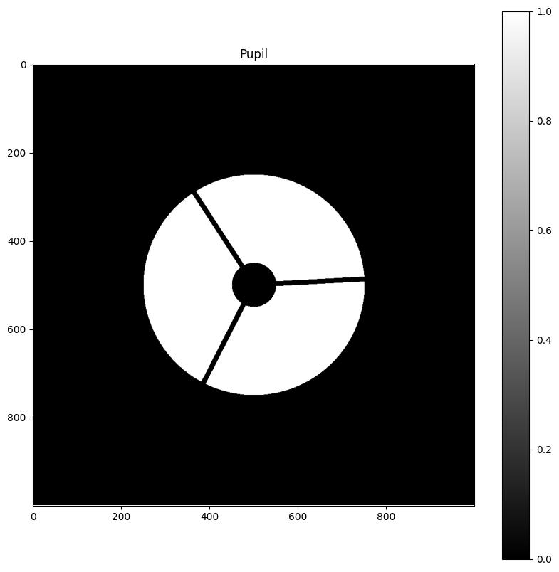
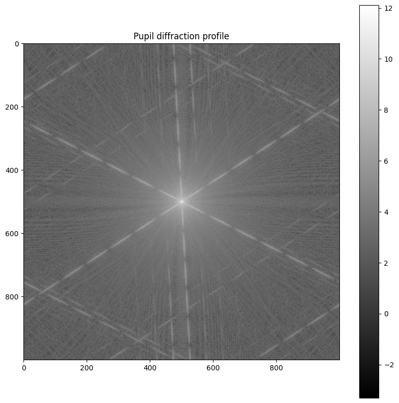

# Diary

> This page contain the diary of the project. I updated it when I did something interesting or when I had a problem. However, I did my best to keep it as complete as possible but as it was the first time I did that, it was not a reflex so it is not fully complete.

## Before

- Sky picture generation module
  - Gaussian sources
  - Gaussian noise
  - Variating magnitude according to probability distribution
- Pupil generation module
  - With central obstruction
  - With spider arms
- Generated fake observations







## 2/11/2022

- Cleaned existing code
  - Added comments
  - Optimized generation
  - Object oriented versions
- Added "shot" module to shorten observation generation code
- Started to watch [object detection AI tutorial on youtubee](https://www.youtube.com/watch?v=yqkISICHH-U)
  - **LIMITATION**: trade-off between speed and precision

## 3/11/2022
- Continued to watch [object detection AI tutorial on youtubee](https://www.youtube.com/watch?v=yqkISICHH-U)
- Found [collection of models based on TensorFlow 2.0](https://github.com/tensorflow/models/blob/master/research/object_detection/g3doc/tf2_detection_zoo.md) with indication of accuracy, speed and output type.
  - Assuming that we are searching for accuracy, not speed
  - "**CenterNet HourGlass104 Keypoints 1024x1024**" model got the higher score on COCO 2017 dataset.

## 4/11/2022
- Continued to watch [object detection AI tutorial on youtubee](https://www.youtube.com/watch?v=yqkISICHH-U)
- **LIMITATION**: TensorFlow models use a specific resolution (usually squared) and automatically compress/decompress pictures that are not using this resolution. As we are dealing with small objects on very high resolution pictures, a compression can result to a loss of information and thus a loss of accuracy. We then have to chose or design a model with a large image resolution as input (which will implies long training phase)
  - **TL;DR** the accuracy of the detections will most probably propotional to $\frac a c$, where $a$ is the angular resolution and $c$ is the compression ratio.
- 3 types of output:
  - Boxes: 2 coordinates representing the box in which there is the object (the most popular one)
  - Keypoints: 1 coordinate (**wrong**, see 05/11/2022) on the object -> We are more interested in this one
  - Masks: that  define the border of the iobject

## 5/11/2022
- Found [a place to select a model according to a specific problem](https://tfhub.dev/s?fine-tunable=yes&module-type=image-object-detection)
- Found [general object detection model application notebook](<https://colab.research.google.com/github/tensorflow/hub/blob/master/examples/colab/tf2_object_detection.ipynb##scrollTo=HtwrSqvakTNn>)
- **Erratum**: Kpoints are actually several coordinates points representing relevant parts of the object (i.e. smaller objects that composer the first one or highly caracteristic part of objects). For instance, for a human, it can be a head, hands, shoulders etc. In the case of stars,it can still be used with 1 keypoint at the center of the star, so it's not an issue.
- **Project consideration**: At this point I have the feeling that, compared to "basic" neural networks such as the one I made for [my previous project](https://github.com/LeiRoF/M1-TNO_Detection_Efficiency) (where the goal was to guess a fix number of values according to a fixed size input array) the object detection models are well more complexe. So complexe that none of the popular tutorial seems to explain how to design one by ourself. It seems to be something dedicated to researchers. If it's the case then the "tuning model" part of this project will have to be redefined into searching the best existing model for this application.

## 24/11/2022
- According to some exemple found on the web, the data have to be in an xml form:

  ```xml
  <annotation>
      <folder>{folder}</folder>
      <filename>{filename}</filename>
      <path>{path}</path>
      <source>
          <database>Unknown</database>
      </source>
      <size>
          <width>{width}</width>
          <height>{height}</height>
          <depth>1</depth>
      </size>
      <object>
          <name>star</name>
              <pose>Unspecified</pose>
              <truncated>Unspecified</truncated>    
              <difficult>Unspecified</difficult>
              <bndbox>
                  <xmin>{x1}</xmin>
                  <ymin>{y1}</ymin>
                  <xmax>{x2}</xmax>
                  <ymax>{y2}</ymax>
              </bndbox>
      </object>
  </annotation>
  ```

## 05/12/2022

- In a totally unscheduled way, I probably found the way to train a TensorFlow model. Fun fact: this solution was provided by another ChatGPT from OpenAI. So an AI provided me the informations I was searching for several dozen hours... I will try it tomorrow.

> __Edit:__ That was very soon after I discorvered ChatGPT, I didn't know the power and the limitations of this tool at this time, neither how to correctly use it to get the most relevant results.

<div align=center style="width:500px">

  

  

  

</div>

## 06/12/2022

- Edited the way to export data to try the solution given by ChatGPT (see 05/12/2022)
- Organized files in steps to be very user-friendly

## 31/12/2022

- Previous solution doesn't work because the models seems to not be trainable, but I found this tutorial: https://tensorflow-object-detection-api-tutorial.readthedocs.io/en/latest/training.html, I will test it.

## 03/01/2023

- I gave up with the previous tutorial due to the mess to install dependencies and make it work while lot of stuff used are deprecated.
- I just thought about looking at PyTorch instead of TensorFlow, which looks more user-friendly.
- I found a new tutorial to train an object detection model (yoloV5): https://github.com/ultralytics/yolov5/wiki/Train-Custom-Data, with a [Google Colab](https://colab.research.google.com/github/ultralytics/yolov5/blob/master/tutorial.ipynb) associated to the model.
- I succeded to train the model! At least, according to the output, now I have to train it on a big dataset and test some predictions.

## 28/01/2023

- According to the logs, the training phase seems to work, but the confusion matrix indicate that it is not able to correctly find a scheme that allow to detect the stars. It is more clear when we start detection, it gives no detection :/
- I made a change in the way the pictures are generated: from magnitude range and magnitude probability, I now use only a probability function to have an intensity (and not a magnitude) which is contain between 0 and 1 (0 -> no photon on the sensor, 1 -> saturation of a pixel). It is more convenient to control what the image will look like.
- Started to write documentation

## 30/01/2023

- Finished the documentation


