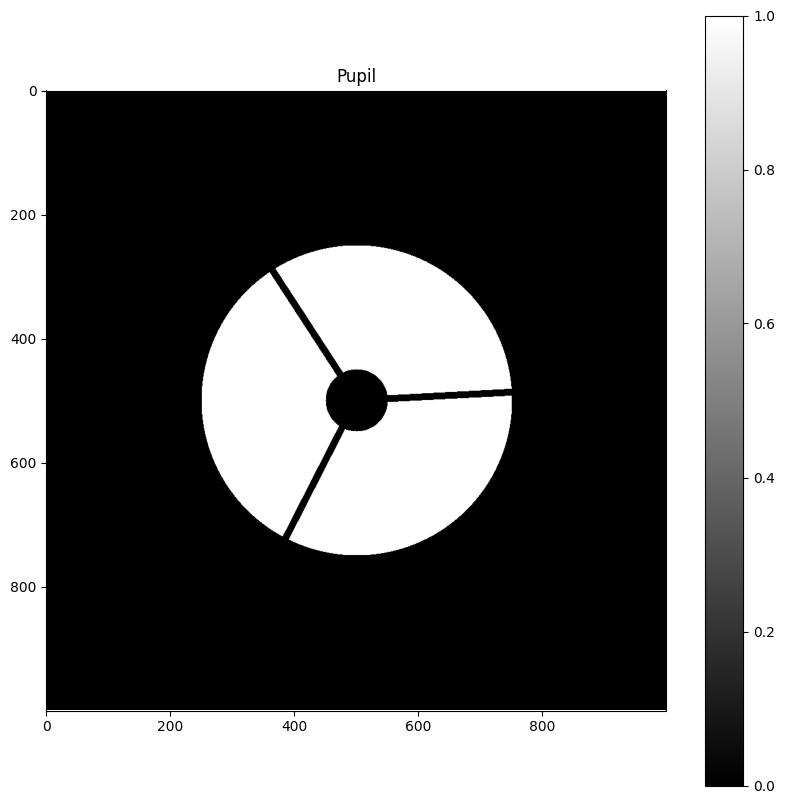

# Pupil

A **`Pupil`** object correspond to the shape of the light well in the telescope. Is is represented by a 2D array filled in 0 (opaque parts) and 1 (transparent part).

Import: `from src import pupil`

---

## Class pupil.`Pupil`

### Attributes

- **N**: The number of pixels in the pupil.
- **radius**: The radius of the pupil.
- **obstruction_radius**: The radius of the central obstruction.
- **arms_count**: The number of arms of the spider.
- **arms_size**: The size of the arms of the spider.
- **arms_angle**: The angle of the arms of the spider (angle formed by the first arm with the x axis)
- **picture**: A 2D numpy array representing the pupil (each pixel is either 1 or 0, representing if the light pass or not).
- **diffraction_profile**: A 2D numpy array representing the diffraction profile of the pupil (each pixel is a float number between 0 and 1, representing the intensity).

---

### Methods

#### pupil.`Pupil(N, radius, obstruction_radius=0, arms_count=0, arms_size=1, arms_angle=0)`

Create a pupil.

:Parameters:

    **N**: The number of pixels in the pupil.

    **radius**: The radius of the pupil.

    **obstruction_radius**: The radius of the central obstruction.

    **arms_count**: The number of arms of the spider.

    **arms_size**: The size of the arms of the spider.

    **arms_angle**: The angle of the arms of the spider (angle formed by the first arm with the x axis).

:Returns:

    A **`Pupil`** object.

---

#### pupil.Pupil.`show(pupil)`

Show the pupil using matplotlib.

:Parameters:

    **pupil**: A **`Pupil`** object.    

:Returns:

    None

---

#### pupil.Pupil.`save(pupil, filename)`

Save the pupil in a png file.

:Parameters:

    **pupil**: A **`Pupil`** object.

    **filename**: A string representing the name of the file where the pupil will be saved.

:Returns:

    None

---

#### pupil.Pupil.`show_diffraction_profile(pupil)`

Show the diffraction profile of the pupil using matplotlib.

:Parameters:

    **pupil**: A **`Pupil`** object.

:Returns:

    None

---

#### pupil.Pupil.`save_diffraction_profile(pupil, filename)`

Save the diffraction profile of the pupil in a png file.

:Parameters:

    **pupil**: A **`Pupil`** object.

    **filename**: A string representing the name of the file where the diffraction profile will be saved.

:Returns:

    None

---

## Functions

### pupil.`create(N, radius, obstruction_radius=0, arms_count=0, arms_size=1, arms_angle=0)`

Create a pupil.

:Parameters:

    **N**: The number of pixels in the pupil.

    **radius**: The radius of the pupil.

    **obstruction_radius**: The radius of the central obstruction.

    **arms_count**: The number of arms of the spider.

    **arms_size**: The size of the arms of the spider.

    **arms_angle**: The angle of the arms of the spider (angle formed by the first arm with the x axis).

:Returns:

    A 2D numpy array representing the pupil (each pixel is either 1 or 0, representing if the light pass or not).

---

### pupil.`diffraction_profile(pupil_picture)`

Compute the diffraction profile of a pupil.

:Parameters:

    **pupil_picture**: A 2D numpy array representing the pupil (each pixel is either 1 or 0, representing if the light pass or not).

:Returns:

    A 2D numpy array representing the diffraction profile of the pupil (each pixel is a float number between 0 and 1, representing the intensity).