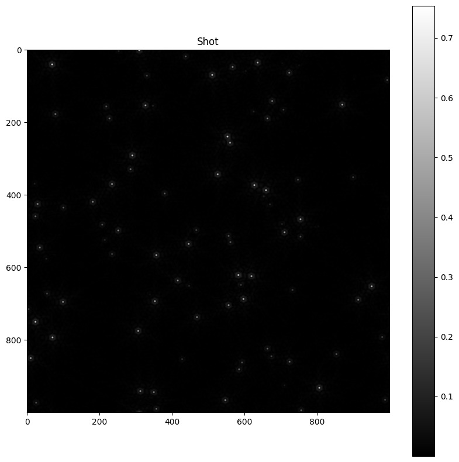

# 📸 Shot

A shot is a picture of the sky that takes into account some diffration effets due to the shape of the telescope pupil.

Import: `from src import shot`

---

## Class shot.`Shot`

### Attributes

- **sky**: A **`Sky`** object used to generate this shot.
- **pupil**: A **`Pupil`** object used to generate this shot.
- **Picture**: A 2D numpy array representing the generated image (each pixel is a float number between 0 and 1, representing the light intensity).

---

### Methods

#### shot.`Shot(sky, pupil)`

Create a shot of a sky with a given pupil.

:Parameters:

    **sky**: A **`Sky`** object.

    **pupil**: A **`Pupil`** object.

:Returns:

    A **`Shot`** object.

---

#### shot.Shot.`show(shot)`

Show the shot.

:Parameters:

    **shot**: A **`Shot`** object.

:Returns:

    None

---

#### shot.Shot.`save(shot, filename)`

Save the shot in a file.

:Parameters:

    **shot**: A **`Shot`** object.

    **filename**: A string representing the name of the file where the shot will be saved.

:Returns:

    None

---

#### shot.Shot.`save_ai_ready(shot, filename)`

Save the shot in a file in a format that is ready to be used by the yoloV5 model.

:Parameters:

    **shot**: A **`Shot`** object.

    **filename**: A string representing the name of the file where the shot will be saved.

:Returns:

    None

---

## Functions

### shot.`generate(sky, pupil)`

Generate a shot of a sky with a given pupil.

:Parameters:

    **sky**: A **`Sky`** object.

    **pupil**: A **`Pupil`** object.

:Returns:

    A 2D numpy array representing the generated image (each pixel is a float number between 0 and 1, representing the light intensity).

