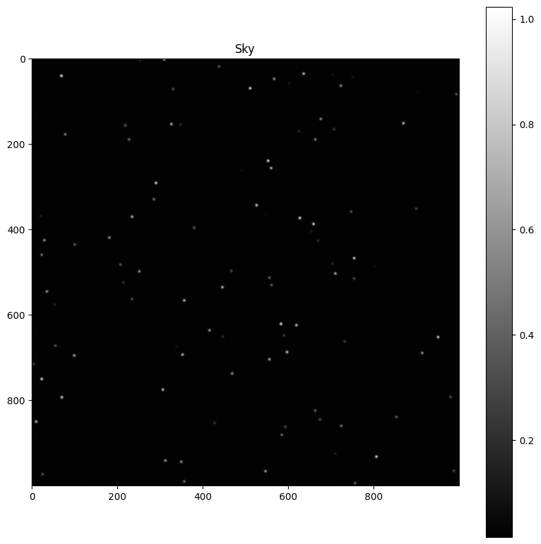

# 🌟 Sky

The sky module allow to create and edit a sky picture in ideal conditions (no atmosphere, no telescope, no camera, no noise, no diffraction etc.). Stars are the represented as purely gaussian sources.

Import: `from src import sky`

## Class sky.`Sky`

### Attributes

- **N**: An integer number of pixel width for the generated image (square image of N by N pixels).
- **nb_stars**: An integer number of stars to generate. If it is not defiend, the default value is `N//10`.
- **fwhm**: A float number representing the full width at half maximum of the stars (in pixels). If it is not defined, the default value is 10 pixels.
- **intensity_prob**: A function that takes a float number between 0 and 1 and returns a float number between 0 and 1. This function is used to define the intensity of the generated stars. The default value is a constant function that returns 1.
- **noise_intensity**: A float number representing the mean intensity of the noise. If it is not defined, there will be no noise.
- **noise_std**: A float number representing the standard deviation of the noise. If it is not defined, there will be no noise.
- **Picture**: A 2D numpy array representing the generated image (each pixel is a float number between 0 and 1, representing the light intensity).

### Methods

#### sky.`Sky(N=100, nb_stars=None, fwhm=None, intensity_prob=lambda x: 1, noise_intensity=None, noise_std=None)`

Create a sky with a given number of stars (point-like sources).

:Parameters:

    **N**: An integer number of pixel width for the generated image (square image of N by N pixels).

    **nb_stars**: An integer number of stars to generate. If it is not defiend, the default value is `N//10`.

    **fwhm**: A float number representing the full width at half maximum of the stars (in pixels). If it is not defined, the default value is 10 pixels.

    **intensity_prob**: A function that takes a float number between 0 and 1 and returns a float number between 0 and 1. This function is used to define the intensity of the generated stars. The default value is a constant function that returns 1.

    **noise_intensity**: A float number representing the mean intensity of the noise. If it is not defined, there will be no noise.

    **noise_std**: A float number representing the standard deviation of the noise. If it is not defined, there will be no noise.

:Returns:

    A **`Sky`** object.

#### sky.Sky.`add_star(sky, x, y, fwhm, lum)`

Add a star to the sky.

:Parameters:

    **sky**: A **`Sky`** object.

    **x**: A float number representing the x coordinate of the star.

    **y**: A float number representing the y coordinate of the star.

    **fwhm**: A float number representing the full width at half maximum of the star (in pixels).

    **lum**: A float number representing the intensity of the star.

:Returns:

    None

#### sky.Sky.`show(sky)`

Plot the sky using matplotlib.

:Parameters:

    **sky**: A **`Sky`** object.

:Returns:

    None

#### sky.Sky.`save(sky, path)`

Save the sky as a png image.

:Parameters:

    **sky**: A **`Sky`** object.

    **path**: A string representing the path (including the file name without extension) where to save the image.

:Returns:
    
    None

#### sky.Sky.`save_stars(sky, path)`

Save the stars as a json file.

:Parameters:

    **sky**: A **`Sky`** object.

    **path**: A string representing the path (including the file name without extension) where to save the stars.

:Returns:

    None

#### sky.Sky.`save_ai_ready(sky, path)`

Save the sky as a png image that can be directly exploited by the yoloV5 model.

:Parameters:

    **sky**: A **`Sky`** object.

    **path**: A string representing the path (including the file name without extension) where to save the image.

:Returns:

    None

#### sky.Sky.`save_stars_ai_ready(sky, path)`

Save the stars as a text file that can be directly exploited by the yoloV5 model.

:Parameters:

    **sky**: A **`Sky`** object.

    **path**: A string representing the path (including the file name without extension) where to save the stars.

:Returns:

    None

## Functions

### sky.`mag_to_lum(mag)`

Convert a magnitude to a luminosity.

:Parameters:

    **mag**: A float number representing the magnitude.

:Returns:

    A float number representing the luminosity.

### sky.`lum_to_mag(lum)`

Convert a luminosity to a magnitude.

:Parameters:

    **lum**: A float number representing the luminosity.

:Returns:

    A float number representing the magnitude.

### sky.`create(N=100, nb_stars=None, fwhm=None, intensity_prob=lambda x: 1, noise_intensity=None, noise_std=None)`

Create a sky with a given number of stars (point-like sources).

:Parameters:

    **N**: An integer number of pixel width for the generated image (square image of N by N pixels).

    **nb_stars**: An integer number of stars to generate. If it is not defiend, the default value is `N//10`.

    **fwhm**: A float number representing the full width at half maximum of the stars (in pixels). If it is not defined, the default value is 10 pixels.

    **intensity_prob**: A function that takes a float number between 0 and 1 and returns a float number between 0 and 1. This function is used to define the intensity of the generated stars. The default value is a constant function that returns 1.

    **noise_intensity**: A float number representing the mean intensity of the noise. If it is not defined, there will be no noise.

    **noise_std**: A float number representing the standard deviation of the noise. If it is not defined, there will be no noise.

:Returns:

    A 2D numpy array representing the generated image (each pixel is a float number between 0 and 1, representing the light intensity).

    A list of tuples (x, y, lum) representing the stars position and luminosity.
